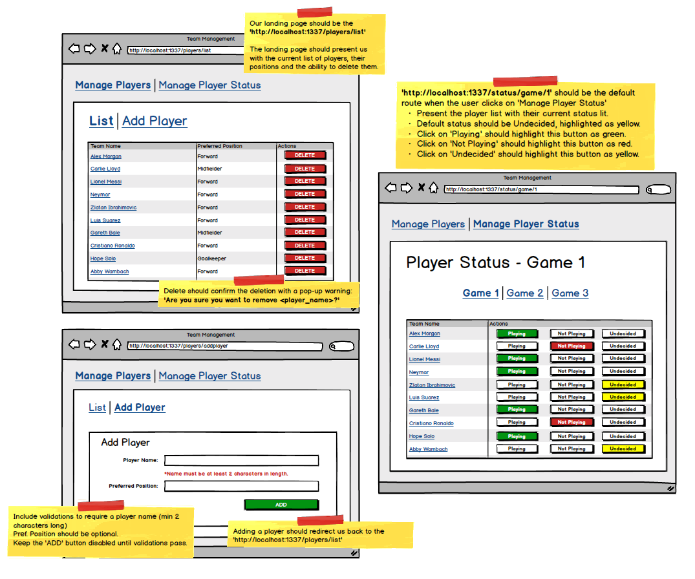

# Javascript_React_Team_manager
<h2>
A React app which manages a team roster and RSVP for a 3 game series.
</h2>

- [x] 	Add and remove players.
- [x] 	View each player's status of 'Playing', 'Not Playing' and 'Undecided' for each of the 3 games. 

